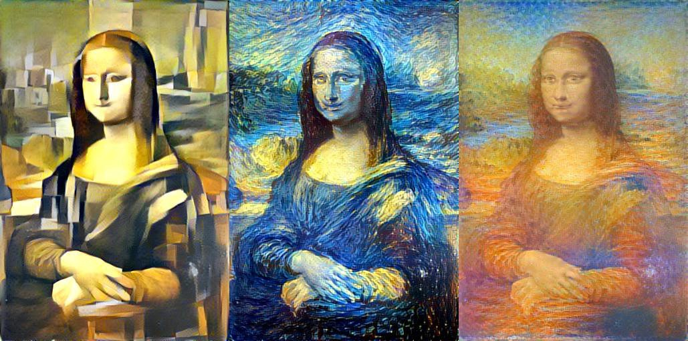

<!-- PROJECT LOGO -->
<br />
<p align="center">
  <a href="https://github.com/Guscode/cds-visual-exam">
    
  </a>
  
  <h1 align="center">Cultural Data Science 2021</h1> 
  <h3 align="center">Visual Analytics Exam</h3> 


  <p align="center">
    Gustav Aarup Lauridsen 
    <br />
  <p align="center">
    ID: au593405 
  </p>
</p>


<!-- TABLE OF CONTENTS -->
<details open="open">
  <summary>Table of Contents</summary>
  <ol>
    <li><a href="#Exam-information">Exam Info</a></li>
    <li><a href="#setup">Setup</a></li>
    <li><a href="#repository-structure">Repository structure</a></li>
    <li>
      <a href="#portfolio-assignments">Portfolio assignments</a>
      <ul>
        <li><a href="#assignment-3---edge-detection">Assignment 3 - Edge detection</a></li>
        <li><a href="#assignment-4---logistic-regression-and-neural-network-benchmark-mnist-classification">Assignment 4 - Logistic Regression and Neural Network benchmark mnist classification</a></li>
        <li><a href="#assignment-5---cnn-classification-of-impressionist-paintings">Assignment 5 - CNN classification of impressionist paintings</a></li>
        <li><a href="#self-assigned-project">self-assigned project</a></li>
      </ul>
    </li>
    <li><a href="#acknowledgements">Acknowledgements</a></li>
    <li><a href="#contact">Contact</a></li>
  </ol>
</details>

<!-- PROJECT INFO -->
## Project info

This repository contains assignments and descriptions regarding an exam in cultural data science at Aarhus Univerisy [_Visual Analytics_](https://kursuskatalog.au.dk/en/course/101992/Visual-Analytics). The three class assignments are included in this repository, and the self-assigned project is found at LINK. 

The class assignments included in this portfolio are:
* Assignment 3 - _Edge detection_
* Assignment 4 - _Logistic Regression and Neural Network benchmark mnist classification_
* Assignment 5 - _CNN classification of impressionist paintings_

<!-- HOW TO RUN -->
## How to run

All scripts have been created and tested using python 3.8.6 on Linux
To run the assignments, you need to go through the following steps in your bash-terminal to configure a virtual environment on Worker02 (or your local machine) with the needed prerequisites for the class assignments:

__Setting up virtual environment and downloading data__
```bash
cd directory/where/you/want/the/assignment
git clone https://github.com/Guscode/cds-visual-exam.git
cd cds-visual-exam
bash create_vis_venv.sh
source visvenv/bin/activate
```

### Assignment 3 - Edge detection

Go through the following steps to run assignment 3:

This code will perform edge detection on a cropped version of jefferson.jpg and save the output image and text in /output.

```bash
cd assignment_3
python3 detect_edges.py --image jefferson.jpg --crop-coordinates X750X700Y750Y1150 --psm 5 --output output
```

This code will perform edge detection on the images in the folder signs and save the output in /output.
```bash
cd assignment_3
python3 detect_edges.py --image-files signs --output output
```

Type: ```python3 edge_detection.py -h``` for a detailed guide on how to specify script-parameters. 


For details and results see [```Assignment_3/README.md```](https://github.com/Guscode/cds-visual-exam/tree/main/Assignment_3)

### Assignment 4 - Classification Benchmarks

Go through the following steps to run assignment 4:

This code will perform classification on the mnist dataset (Lecun, 2010) using logistic regression and a neural network.
Logistic regression:
```bash
cd assignment_4
python src/lr-mnist.py -m download -ts 0.1 -t test.png -o outputs
```

Neural Network:
```bash
python src/nn-mnist.py -m download -ts 0.1 -t test.png -s outputs
```

Type: ```python src/nn-mnist.py -h``` for a detailed guide on how to specify script-parameters. 


For details and results see [```Assignment_4/README.md```](https://github.com/Guscode/cds-visual-exam/tree/main/Assignment_4)

### Assignment 5 - CNNs on cultural image data

Go through the following steps to run assignment 4:

This code will train a convulutional neural network on images from impressionist painters, as found [here](https://www.kaggle.com/delayedkarma/impressionist-classifier-data).

```bash
cd assignment_5
python cnn-artists.py -e 10 -t ../data/impressionist/training -v ../data/impressionist/validation
```

Type: ```python cnn-artists.py -h``` for a detailed guide on how to specify script-parameters. 


For details and results see [```Assignment_5/README.md```](https://github.com/Guscode/cds-visual-exam/tree/main/Assignment_5)


### Self-assigned project - State of the art style-transfer for video

The self-assigned project is hosted in this repo [```self_assigned_project```](https://github.com/Guscode/stylenet)

This code will train a convulutional neural network on images from impressionist painters, as found [here](https://www.kaggle.com/delayedkarma/impressionist-classifier-data).

### Acknowledgements

* [Ross Deans Kristensen-McLachlan](https://github.com/rdkm89) for teaching and invaluable coding help
* [Frida Hæstrup](https://github.com/frillecode) for help and support and some wine 
* [Marie Mortensen](https://github.com/marmor97) for big brain energy 
* [Johan Horsmans](https://github.com/JohanHorsmans) for helping with readme structure and being a stand up guy
* [Emil Jessen](https://github.com/emiltj) for helping with readme structure and being a stand up guy


